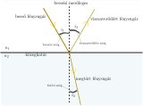
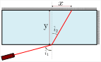

<H1>
A fény viselkedése közegek határán
</H1>

## 0. Tartalomjegyzék 
1. [Geometriai optika alapfogalmai](#1-geometriai-optika-alapfogalmai-elmélet)
2. [Geometriai optika alapelvei](#2-geometriai-optika-alapelvei-elmélet)
3. [Fényvisszaverődés és fénytörés törvényei](#3-fényvisszaverődés-és-fénytörés-törvényei-elmélet)
4. [A Fermat - elv](#4-a-fermat---elv-elmélet)
       4.1 [Törésmutató (**n**)](#törésmutató)
5. [Töréstörvény levezetése](#5-töréstörvény-levezetése-opcionális-levezetés)
6. [A töréstörvény kísérleti ellenőrzése](#6-a-töréstörvény-ellenőrzése-kísérlet)
       6.1[Töréstörvény videó](#a-töréstörvény-kísérleti-ellenőrzése)
7. [Diszperzió, színekre bontás](#7-diszperzió-színekre-bontás)
8. [Színekre bontás - kísérlet](#8-színekre-bontás-kísérlet)
       8.1 [**n** és **H** közötti összefüggés a diszperziós kísérlet során](#végső-képlet-levezetése-n-és-h-között)
 

<small><small><small>*[Tartalomjegyzék](#0-tartalomjegyzék)*</small></small></small>
## 1. Geometriai optika alapfogalmai [*elmélet*]
 
* <strong style="color:rgb(11, 76, 5)">Fényforrás</strong> : Fényt kibocsátó test (saját energiáját használja fel a fény kibocsátásához, általában más típusú energiát alakít át fénnyé)  Fényforrás lehet : 
    - pontszerű (elhanyagolhatóan kis szög alatt látható fényforrás) pl távoli csillag fénye a szemünkhöz képest
    - vonalas (nagyon keskeny fényforrás)
    - normál fényforrás

Ezek voltak az elsődleges fényforrások, viszont bármely test visszaveri a ráeső fény egy részét, így ezek a testek <strong style="color:rgb(11,76,5)">**másodlagos fényforrások**</strong>.

* <strong style="color:rgb(11, 76, 5)">Fénysugár</strong> : A pálya (görbe), amely mentén a fény terjed
* <strong style="color:rgb(11, 76, 5)">Fénynyaláb</strong> : Több fénysugár, amiket együtt vizsgálunk                                                                                   
Fénynyaláb lehet :
    - párhuzamos 
    - széttartó (divergens)
    - összetartó (konvergens)   
<figure>

  
  <figcaption><h3 align="center">Ábra 1.   Nyalábok</h3></figcaption>

</figure>

<small><small><small>*[Tartalomjegyzék](#0-tartalomjegyzék)*</small></small></small>

## 2. Geometriai optika alapelvei [*elmélet*]

* Homogén közegben a fény egyenes vonalban terjed
* A fénysugarak egymástól függetlenül terjednek
* a fénysugarak terjedése megfordítható, tehát két pont közt mindkét irányban ugyanaz a fénysugár, ugyanazt a pályát teszi meg a fény A pontból B pontba és B pontból A pontba
* A geometriai optika akkor alkalmazható, ha az optikai rendszer (karakterisztikus) mérete sokkal nagyobb, mint a fénysugarak hullámhossza
* Érvényes a Fermat-elv

<small><small><small>*[Tartalomjegyzék](#0-tartalomjegyzék)*</small></small></small>

## 3. Fényvisszaverődés és fénytörés törvényei [*elmélet*]

Ha a fénysugár két, optikailag különböző közeg határfelületére esik két dolog fog történni:
* A fénysugár egy része visszaverődik a felületről, ez a <strong style="color:rgb(11, 76, 5)">fényvisszaverődés</strong>

* A fénysugár másik része áthalad a közeghatáron és irányt változtatva halad tovább a közegben, amibe behatolt. Ez a <strong style="color:rgb(11, 76, 5)">fénytörés</strong> jelensége

### *Törésmutató*
A közegek jellemzésére a <strong style="color:rgb(11, 76, 5)">törésmutató</strong> mennyiséget használjuk, amit <strong style="color:rgb(11, 76, 5)">n</strong>-el jelölünk. A törésmutató a fénysebesség és az adott anyagban a fény terjedési sebességének hányadosa. Ez az **abszolút törésmutató**, amely a vákuumbeli fénysebességhez (<strong style="color:rgb(11, 76, 5)">c</strong>) viszonyítva adja meg a törésmutatót.
$$
n=\frac{c}{v}
$$

Kísérletileg kimérhetőek és elméleti síkon is többféleképpen igazolhatóak a fénytörés és a fényvisszaverődés törvényei, tehát a kapcsolat a <strong style="color:rgb(11, 76, 5)">beesési</strong>, a <strong style="color:rgb(11, 76, 5)">visszaverődési</strong> és a <strong style="color:rgb(11, 76, 5)">megtört</strong> fénysugár szöge, valamint a közegre jellemző <strong style="color:rgb(11, 76, 5)">törésmutató</strong>k közt. A törvények a következők:

* A beeső, a megtört (áthaladt) és a visszavert fénysugár mind **egy síkban vannak** 

* a beesési merőlegeshez mérve (ez az az egyenes amely merőleges a két közeg határfelületére a beesési pontban) a <strong style="color:rgb(11, 76, 5)">beesési szög</strong> és a <strong style="color:rgb(11, 76, 5)">visszaverődési szög</strong> mértéke **egyenlő** 
$$
\vert \hat {i_1}\vert=\vert \hat {i_3}\vert
$$

* Mindig érvényes a **Snellius-Descartes-töréstörvény**, ez a következő:
$$
n_1\cdot \sin(i_1) = n_2\cdot \sin(i_2),
$$
ahol <strong style="color:rgb(11, 76, 5)">n1</strong> az 1-es, <strong style="color:rgb(11, 76, 5)">n2</strong> pedig a 2-es közeg abszolút törésmutatója, <strong style="color:rgb(11, 76, 5)">sin(i1)</strong> a beesési szög szinusza, <strong style="color:rgb(11, 76, 5)">sin(i2)</strong> pedig a törési szög szinusza

<figure>

  
  <figcaption><h3 align="center">Ábra 2. - Fénytörés és fényvisszaverődés törvényei</h3></figcaption>

</figure>

<small><small><small>*[Tartalomjegyzék](#0-tartalomjegyzék)*</small></small></small>

## 4. A Fermat - elv [*elmélet*]

*Bármely fénysugár egy tetszőleges optikai rendszerben
mindig olyan pályát követ, amelyre nézve a kezdő és végpontok
közötti terjedési idő minimális vagy maximális (legtöbb esetben minimális).*

Másképpen megfogalmazva:

*Bármely közegben A és B pontok között a fény azon a görbén halad, amely mentén az optikai útnak szélsőértéke van.*

Az optikai út <strong style="color:rgb(11, 76, 5)">L</strong> a megtett távolság és a törésmutató szorzata egy közegben. Ha több közegünk van, akkor ez összeadódik.

$$
L=n_1\cdot l_1 + n_2\cdot l_2 + n_3\cdot l_3 + ... + n_N\cdot l_N 
$$

<small><small><small>*[Tartalomjegyzék](#0-tartalomjegyzék)*</small></small></small>

## 5. Töréstörvény levezetése [*opcionális levezetés*]

A Fermat-elvből kiindulva középiskolás (11. osztályos) matematikai számításokat használva egyértelműen kimutatható a töréstörvény. 
Vegyünk tetszőleges két pontot (**A** és **B**) két közegben, melyet egy határfelület választ el. A két közeg <strong style="color:rgb(11, 76, 5)">n1</strong> és <strong style="color:rgb(11, 76, 5)">n2</strong> törésmutatóval rendelkeznek.

<figure>

  
  <figcaption><h3 align="center">Ábra 3. - Fénytörés törvényének levezetése </h3></figcaption>

</figure>
 

Felírjuk **AOX** háromszögben a Pitagorasz-tételt, kifejezve <strong style="color:rgb(115, 103, 10)">l1</strong>-et (átfogó), ami a fénysugár által megtett út az 1-es közegben.
$$
l_1\space^2=x^2+h_1\space ^2
$$
$$
l_1=\sqrt{x^2+h_1\space ^2}
$$
Felírjuk **BCX** háromszögben is a Pitagorasz-tételt, kifejezve <strong style="color:rgb(115, 103, 10)"> l2</strong>-t (átfogó), ami a fénysugár által megtett út a 2-es közegben.  **[CX]** szakasz hossza: **D - x**
$$
l_2\space^2=(D-x)^2+h_2\space ^2
$$
$$
l_2=\sqrt{(D-x)^2+h_2\space ^2}
$$
A Fermat elv azt mondja ,hogy az optikai útnak szélsőértéke kell legyen. Felírjuk az optikai utat **A**-ból  **B**-be
$$
L= n_1\cdot l_1 + n_2\cdot l_2
$$
$$
L= n_1\cdot \sqrt{x^2+h_1\space ^2} + n_2\cdot \sqrt{(D-x)^2+h_2\space ^2}
$$
Szélsőértékét keresünk <strong style="color:rgb(115, 103, 10)">L</strong>-nek. <strong style="color:rgb(115, 103, 10)">L</strong> csakis az <strong style="color:rgb(76, 21, 21)">x</strong> hossztól függ, a többi mennyiség mind állandó, tehát a szélsőértékfeltétel a következő:
$$
\frac{\mathrm dL}{\mathrm dx}=0
$$
kiszámítjuk a bal oldalt:
$$
\frac{\mathrm dL}{\mathrm dx}=\frac{\mathrm d}{\mathrm dx}(n_1\cdot \sqrt{x^2+h_1\space ^2} + n_2\cdot \sqrt{(D-x)^2+h_2\space ^2})= 
$$
$$
n_1\cdot \frac{1}{2\cdot\sqrt{x^2+h_1\space ^2}}\cdot\frac{\mathrm d}{\mathrm dx}(x^2+h_1)\space ^2 + n_2\cdot\frac{1}{2\cdot\sqrt{(D-x)^2+h_2\space ^2}}\cdot\frac{\mathrm d}{\mathrm dx}((D-x)^2+h_2\space^2)= 
$$
$$
n_1\cdot \frac{1}{2\cdot\sqrt{x^2+h_1\space ^2}}\cdot 2\cdot x\space + n_2\cdot\frac{1}{2\cdot\sqrt{(D-x)^2+h_2\space ^2}}\cdot2\cdot (D-x)\cdot(-1)\space= 
$$
$$
n_1\cdot \frac{x}{\sqrt{x^2+h_1\space ^2}} - n_2\cdot\frac{D-x}{\sqrt{(D-x)^2+h_2\space ^2}}\space=
$$
$$
n_1\cdot \frac{x}{l_1} - n_2\cdot\frac{D-x}{l_2}\space
$$

Észrevesszük, hogy az **AOX** és **BCX** háromszögben: $$\frac{x}{l_1} = \sin(i_1)$$ $$\frac{D-x}{l_2} = \sin(i_2)$$  
Tehát  
$$
\frac{\mathrm dL}{\mathrm dx}=n_1\cdot \sin(i_1) - n_2\cdot\sin(i_2)=0
$$
Ebből tehát következik:
$$
n_1\cdot \sin(i_1) = n_2\cdot\sin(i_2)
$$
Tehát igazoltuk a töréstörvényt. Észrevehető továbbá, hogy **A** és **B** pontot bárhol, bármilyen pozícióba választom a közeg két oldalán, az eredmény a pozícióktól független, tehát általános esetben is érvényes a töréstörvény levezetése. 

<small><small><small>*[Tartalomjegyzék](#0-tartalomjegyzék)*</small></small></small>

## 6. A töréstörvény ellenőrzése [*kísérlet*]

A kísérlethez vegyünk egy átlátszó tálat, ami téglatest alakú és töltsük fel vízzel. Egy lézerpointerrel érdemes a kísérletet végezni, hiszen  eléggé megközelíti a pontszerű viselkedést, tehát a keskeny sugarú nyaláb jól látható lesz az edény falán. Egy másik kiküszöbölhető jelenség a diszperzió (<strong style="color:rgb(12, 12, 66)">[a diszperzióról később](#7-diszperzió-színekre-bontás)</strong>), hiszen a lézerpointer jó közelítéssel monokromatikus, egyszínű ( &lambda; = 650 nm hullámosszú kapható könnyedén használni) .

<figure>

  
  <figcaption><h3 align="center">Ábra 4. - Kísérleti berendezés felülnézetből </h3></figcaption>

</figure> 

* Meghatározzuk az <strong style="color:rgb(11, 76, 5)">x</strong> = 0 koordinátát a szögmérő segítségével. Lehetséges másképp is, ha előre az edényre beosztásokat karcolunk

<figure>

  
  <figcaption><h3 align="center">Ábra 5. - Az x=0 koordináta meghatározása </h3></figcaption>

</figure> 

* Az <strong style="color:rgb(11, 76, 5)">**i1**</strong> beesési szög közvetlenül mérhető a szögmérő korongon, számológéppel pedig kiszámolható <strong style="color:rgb(11, 76, 5)">**sin(i1)** </strong>
* A víz törésmutatója, <strong style="color:rgb(11, 76, 5)">n</strong> ismert nagy pontossággal, a vörös (&lambda; = 650 nm hullámhosszú) fényre ez az érték <strong style="color:rgb(11, 76, 5)">n</strong> = 1.33257. (A kísérletünk során lesznek eltérések ettől az értéktől)
* <strong style="color:rgb(11, 76, 5)">x</strong> értékét le tudjuk mérni az edény falán, ekkor <strong style="color:rgb(11, 76, 5)">y</strong> értéke az edény szélessége
* Ha a fénysugár nem a közeghatárral szemközti, hanem az edény oldalsó falára esik, akkor <strong style="color:rgb(11, 76, 5)">y</strong> értékét le tudjuk mérni az edény oldalsó falán, ekkor <strong style="color:rgb(11, 76, 5)">x</strong> értéke az edény falán mérve a belépési ponttól, a 0 koordinátától mérem az edény végéig. 

* a levegő törésmutatóját 1-nek tekintjük

Tehát ismerve a mérendő mennyiségeket felírjuk a töréstörvényt:
$$
\sin(\hat i_1)=n\cdot\sin(\hat i_2)
$$
Behelyettesítve az ismert mennyiségeket
$$
\sin(\hat i_1)=n\cdot\frac{x}{\sqrt{x^2+y^2}}
$$

Ábrázolva egy grafikonon sin(**i1**)-et sin(**i2**) függvényében az ábrázolt pontok egy egyenesre illeszkednek majd. Ennek  az egyenesnek meghatározva az iránytényezőjét, vissza kell kapnunk <strong color="rgb(11,76,5)">n</strong> értékét. A kísérlet során léphetnek fel pontatlanságok, de az eredmény találni fog jó közelítéssel a már ismert törésmutató értékkel, így igazolhatjuk, hogy a töréstörvény nem csak elméletileg, hanem kísérletben is, a valóságban igaz.

### A töréstörvény kísérleti ellenőrzése 
<iframe width="1250" height="703" src="https://www.youtube.com/embed/fViyYYHDf1k" title="A Snellius- Descartes-töréstörvény kísérleti ellenőrzése" frameborder="0" allow="accelerometer; autoplay; clipboard-write; encrypted-media; gyroscope; picture-in-picture; web-share" referrerpolicy="strict-origin-when-cross-origin" allowfullscreen></iframe>

<small><small><small>*[Tartalomjegyzék](#0-tartalomjegyzék)*</small></small></small>

## 7. Diszperzió, színekre bontás 

A természetes fény és a legtöbb fényforrás is "fehér" fény, tehát több, különböző hullámhosszú fény összege, szuperpozíciója, egymásra tevődése.  

A **diszperzió** fogalma azzal kapcsolatos, hogy egy hullám terjedési sebessége függ a hullám frekvenciájától (tehát hullámhosszától is). 

Ez a fény esetén azt jelenti, hogy adott hullámhosszú fény egy átlátszó közegben más sebességgel terjed, mint egy más hullámhosszú fény. (1)  

(1)<small>ez a sebesség nem a fénysebesség, hanem a közeg elektronjai által keltett elektromágneses hullámok szuperpozíciójának, vagyis összegének a terjedési sebessége , tehát a fénysebesség továbbra is állandó, c = 299 792 458 m/s ! A kíváncsiabbaknak itt található egy angol nyelvű, magasabb szintű, de jól követhető, vizuális magyarázat erről a jelenségről.  [  **link a videóhoz**  ](https://youtu.be/KTzGBJPuJwM?si=Xbgp-1il2tdr_prH)</small>.

Mivel <strong style="color:rgb(11, 76, 5)">n</strong> törésmutatót úgy határoztuk meg, mint a fénysebesség és a közegbeli terjedési sebesség hányadosa , így a törésmutató is más lesz különböző hullámhosszakra. <strong style="color:rgb(11, 76, 5)">n</strong> <strong style="color:rgb(11, 76, 5)">&lambda;</strong> függvénye, <strong style="color:rgb(11, 76, 5)">n</strong> függ <strong style="color:rgb(11, 76, 5)"> &lambda;</strong>-tól.
$$n=n(\lambda)$$

<small><small><small>*[Tartalomjegyzék](#0-tartalomjegyzék)*</small></small></small>

## 8. Színekre bontás [*kísérlet*]

Kísérletileg bebizonyíthatjuk ezen kapcsolat létezését. Építsük meg a következő kísérleti berendezést:

<figure>

  
  <figcaption><h3 align="center">Ábra 6. - Kísérleti berendezés oldalnézetből </h3></figcaption>

</figure> 

* Egy tálba belehelyezünk egy síktükröt, az alját támasszuk meg, hogy ne mozduljon el. Szükségünk lesz továbbá egy kevésbé széttartó, keskeny nyalábot létrehozó fényforrásra

* Ki kell számítanunk a tükör és a vízszintes közti szög szinuszát (<strong style="color:rgb(11, 76, 5)"> sin(&alpha;)</strong> ) .
A doboz oldalán felülről nézve, egy vonalzó segítségével bejelöljük a tükör aljának helyét az edény falán, ez a kezdeti 0 koordináta.

* Feltöltjük vízzel az edényt. A 0 koordinátától a doboz oldalán nézve megmérjük vízszintes irányban az <strong style="color:rgb(11, 76, 5)">x1</strong> távolságot, amit a tükörfelület és a vízfelület találkozási pontjáig mérünk. 

* Ahol a vízfelület és a tükörfelület találkozik egy bejegyzést rajzolunk. Kivéve a tükröt a vízből megmérhetjük a tükör vízben levő részének hosszát, ez <strong style="color:rgb(11, 76, 5)">x2</strong>. Így: 
$$
\cos(\alpha)= \frac{x_1}{x_2}
$$
$$
\sin(\alpha)= \frac{\sqrt{x_2\space^2-x_1\space^2}}{x_2}
$$

* Megmérjük a vízszintet (<strong style="color:rgb(11, 76, 5)">y1</strong>)

* Meg kell mérnünk továbbá a vízfelület és a tükörfelület találkozási pontjától a távolságot az ernyőig (falig), ahol nézni fogjuk a felbontott fénysugarakat. Ez a távolság <strong style="color:rgb(11, 76, 5)">D</strong>.  

* Amikor a keskeny fénysugárral megvilágítjuk függőlegesen a tükröt a vizen keresztül, fontos , hogy egy meghatározott helyen tegyük ezt. Érdemes lemérni, hogy <strong style="color:rgb(11, 76, 5)">x1</strong> hányad része az ábrán bejelölt <strong style="color:rgb(11, 76, 5)">&epsilon; &middot; x1</strong> távolság.

Ezek az értékek állandók a kísérlet során. A táblázatba beírhatóak ezek az értékek:

| **x1**|**x2** | **D** | **&epsilon;**|**y1**|
|------------|---|------|---|---|
| 0 koordináta és a  két felület találkozása vízszintesen mérve |tükör vízben  levő hossza | faltól (vízfelület - tükör)  találkozási pontig  |**x1** hányad részénél  jut be a fénysugár  a vízbe|vízszint|
|  .|  |  |  |  | |
----
 

Ha megvagyunk az állandó mennyiségek megmérésével, akkor világítsuk meg a vizet merőlegesen felülről. A falon (ernyőn) színes csíkok jelennek meg szivárványszerűen.  Mi megkeressük a középsőt és két jól látható színt választunk. Ezeknek megmérjük a magasságát a padlóhoz képest, ebből pedig kivonjuk a tükör aljának magasságát a padlóhoz képest. ez lesz <strong style="color:rgb(11, 76, 5)">H1</strong> és <strong style="color:rgb(11, 76, 5)">H2</strong>.

### Végső képlet levezetése n és H között

Most a törésmutató <strong style="color:rgb(11, 76, 5)">n</strong>  és a falon mért <strong style="color:rgb(11, 76, 5)">H</strong> magasság közötti kapcsolat matematikai levezetése következik:  

* A vizen áthaladva a fény nem törik meg, hiszen merőleges beesés esetén sin(0)=0. 

* A tükörről való visszaverődés során a fénysugár továbbhalad a vízben és a víz-levegő határfelülethez érkezik. A [<strong style="color:rgb(12, 12, 66)">6. Ábrán</strong>](#8-színekre-bontás-kísérlet) is látszik, hogy a beesési szög ezen a határfelületen = **2 &middot; &alpha;**
* Felírhatjuk a töréstörvényt, ahol **&beta;** a kilépő sugár szöge lesz
$$
n\cdot\sin(2\alpha)=\sin(\beta)
$$
$$
2\cdot n\cdot\sin(\alpha)\cos(\alpha)=\sin(\beta)
$$

* A vízből való kilépés után  tudjuk, hogy:
$$
\tg(90-\beta)=\ctg(\beta)=\frac{h}{d}=\frac{\cos(\beta)}{\sin(\beta)},\space\space\space\space\space\space\space\space\space\space\space\space\space\space\space\space\space\space\space\space\space\space\space\space [\star]
$$

,ahol 
$$
h = H - y_1 - y_0
$$
<strong style="color:rgb(11, 76, 5)">y0</strong> a tükör aljának a magassága a földhöz képest

A bejövő fénysugár menetét követve háromszögekből kihozható a következő összefüggés:
$$
d = D - \epsilon\cdot x_1(1+\tg\alpha\cdot\tg 2\alpha)
$$
* És:
$$
\sin^2(\beta)+\cos^2(\beta)=1
$$
$$
\cos(\beta)=\sqrt{1-\sin^2(\beta)}=\sqrt{1-[2\cdot n\cdot\sin(\alpha)\cos(\alpha)]\space^2}=\sqrt{1-4n^2\cdot\sin(\alpha)\cos(\alpha)}
$$
* Folytatva:
$$
[\star]\Longrightarrow\space \frac{h^2}{d^2}=\frac{\cos^2(\beta)}{\sin^2(\beta)}=\frac{1-4n^2\cdot\sin(\alpha)\cos(\alpha)}{n^2\cdot sin^2(\alpha)}
$$
* Ezt az egyenletet átrendezzük 
$$
n=\frac{1}{\sin(\alpha)\cdot\sqrt{[\frac{h^2}{d^2}+4\cos^2(\alpha)]}}
$$

* Megkaptuk a végső képletet:
$$
n=\frac{1}{\sin{\alpha}\cdot\sqrt{(\frac{H-y_1-y_0}{{D-\epsilon\cdot x_1\cdot(\space\tg(2\alpha)\tg(\alpha)\space)\space}})^2+4\cos^2(\alpha)}}
$$
A végső képletben a trigonometrikus tagok mind meghatározhatók x1 és x2 ismeretében:

$$\cos^2(\alpha)=\frac{x_1}{x_2}$$
$$\sin^2(\alpha)=\frac{\sqrt{x_2\space^2-x_1\space^2}}{x_2}$$
$$\tg(\alpha)=\frac{\sqrt{x_2\space^2-x_1\space^2}}{x_1}$$
$$\tg(2\alpha)\cdot\tg(\alpha)=\frac{2}{\frac{1}{\tg(\alpha)}-\tg(\alpha)}=\frac{2}{\frac{x_1}{\sqrt{x_2\space^2-x_1\space^2}}-\frac{\sqrt{x_2\space^2-x_1\space^2}}{x_1}}$$
Az eredményeinket bevezethetjük a követező táblázatba:

|Mérés sorszám| H1 | H2 | n1 | n2 | &Delta;H|&Delta;n|
|------------|---|------|----|---|---|---|
| 1. |  | |  |  |  |  |
| 2. |  | |  |  |  |  |
| 3. |  | |  |  |  |  |
| 4. |  | |  |  |  |  |
| 5. |  | |  |  |  |  |
| 6. |  | |  |  |  |  |

Az eredményeink ellenőrzésére ismernünk kell a színekhez tartozó fénysugarak hullámhosszait, hogy a törésmutató értéket összehasonlíthassuk a pontos értékekkel. A hullámhosszakhoz tartozó törésmutatók az alábbi táblázatban találhatóak meg:

|&lambda;| n | szín |
|------------|---|------|
| 400 | 1,34451 | _____________ |
| 425 | 1,34235 | _____________ |
| 450 | 1,34055 | _____________ |
| 475 | 1,33903 | _____________ |
| 500 | 1,33772 | _____________ |
| 525 | 1,33659 | _____________ |
| 550 | 1,33560 | _____________ |
| 575 | 1,33472 | _____________ |
| 600 | 1,33393 | _____________ |
| 625 | 1,33322 | _____________ |
| 650 | 1,33257 | _____________ |
| 675 | 1,33197 | _____________ |
| 700 | 1,33141 | _____________ |

Táblázat 1. - Adott hullámhossz esetén a víz törésmutatójának értéke 

### Színbontásos kísérleti útmutató videó 

<iframe width="1250" height="703" src="https://www.youtube.com/embed/xwHbIHBITIk" title="A fény színekre bontása, diszperzió" frameborder="0" allow="accelerometer; autoplay; clipboard-write; encrypted-media; gyroscope; picture-in-picture; web-share" referrerpolicy="strict-origin-when-cross-origin" allowfullscreen></iframe>

[*Tartalomjegyzék*](#0-tartalomjegyzék)
